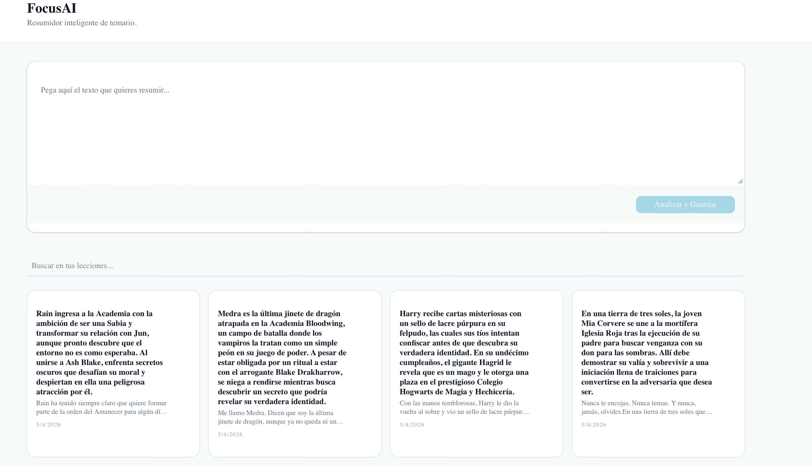

# FocusAI - Tu Cerebro de Aprendizaje Inteligente

> Resumidor inteligente de temario con IA local y almacenamiento en la nube.

> [!IMPORTANT]
Esta aplicación utiliza un modelo de IA híbrido. Asegúrate de tener **Ollama** ejecutándose en tu red local para que el procesamiento de resúmenes funcione correctamente.

## Arquitectura

FocusAI utiliza un sistema híbrido que combina:

- **Vercel (Next.js)**: Frontend renderizado en el edge para máxima velocidad
- **Supabase**: Base de datos PostgreSQL + Autenticación + Storage
- **Ollama (Windows)**: Modelo de IA local (Llama3/Qwen) para procesamiento offline

```
┌─────────────────────────────────────────────────────────┐
│                    FocusAI App                           │
├──────────────┬─────────────────┬─────────────────────────┤
│   Next.js    │   Supabase      │   Ollama (Local)        │
│   (Frontend) │   (Backend)     │   (IA Local)            │
│              │                 │                         │
│  - UI/UX     │  - Datos        │  - Llama3.2             │
│  - Paginación│  - CRUD         │  - Qwen2.5               │
│  - Buscador  │  - Autenticación│  - Procesamiento offline │
└──────────────┴─────────────────┴─────────────────────────┘
```

## Screenshot



> [!TIP]
Para obtener mejores resultados en los resúmenes, intenta pegar textos estructurados por párrafos. El modelo Qwen 2.5 es especialmente bueno manteniendo el formato de listas.
> 

## Escalabilidad

FocusAI está diseñado para crecer con tus necesidades:

### Exportación a Notion/PDF
- Exporta tus lecciones directamente a Notion
- Genera PDFs con formato profesional para imprimir

### Sistema de Tags por Colores
- Organiza tus notas con etiquetas visuales
- Colores por categoría: 🟢 Conceptos, 🔵 Ejemplos, 🔴 Importante

### Selector de Modelos de IA
- Cambia entre modelos en tiempo real:
  - **Llama3.2**: Excelente para español
  - **Qwen2.5**: Multilingüe avanzado
  - **Mistral**: Rápido y eficiente

## Instalación

### Requisitos Previos

1. **Node.js 18+** y npm/pnpm
2. **Ollama** instalado en Windows:
   ```bash
   winget install Ollama.Ollama
   ollama pull llama3.2
   ```
> [!WARNING]
Si accedes desde una red distinta, la IP de tu servidor Ollama puede cambiar. Verifica siempre tu OLLAMA_URL en el entorno.

### Configuración

1. Clona el repositorio:
   ```bash
   git clone <tu-repo>
   cd focus-ai
   ```

2. Instala dependencias:
   ```bash
   npm install
   ```

3. Crea `.env.local`:
   ```env
   NEXT_PUBLIC_SUPABASE_URL=tu_url_supabase
   NEXT_PUBLIC_SUPABASE_ANON_KEY=tu_anon_key
   OLLAMA_BASE_URL=http://localhost:11434
   ```

4. Ejecuta:
   ```bash
   npm run dev
   ```

## Estructura del Proyecto

```
focus-ai/
├── app/
│   ├── api/summarize/route.ts    # API para Ollama
│   ├── layout.tsx                # Layout principal
│   └── page.tsx                  # Home con paginación
├── components/ui/
│   ├── button.tsx
│   ├── card.tsx
│   ├── textarea.tsx
│   └── pagination.tsx            # Componente de paginación
├── hooks/
│   └── useLecciones.ts           # Hook con paginación
├── lib/
│   ├── supabase.ts               # Cliente Supabase
│   └── utils.ts
├── service/
│   └── lecciones.ts              # CRUD de lecciones
└── README.md
```

## Variables de Entorno

| Variable | Descripción |
|----------|-------------|
| `NEXT_PUBLIC_SUPABASE_URL` | URL de tu proyecto Supabase |
| `NEXT_PUBLIC_SUPABASE_ANON_KEY` | Key pública de Supabase |
| `OLLAMA_BASE_URL` | URL de Ollama (default: localhost:11434) |

> [!NOTE]
En producción (Vercel), asegúrate de configurar el Timeout de la Función a 60s, ya que los modelos de IA locales pueden tardar en procesar textos largos.

## Licencia

MIT License - © FocusAI
